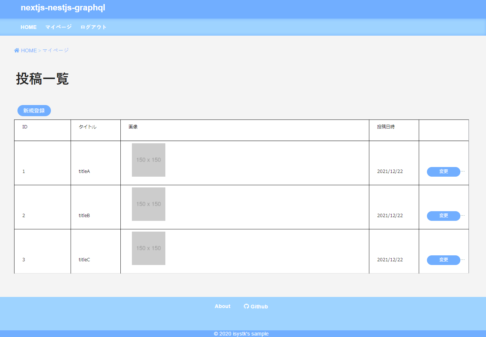
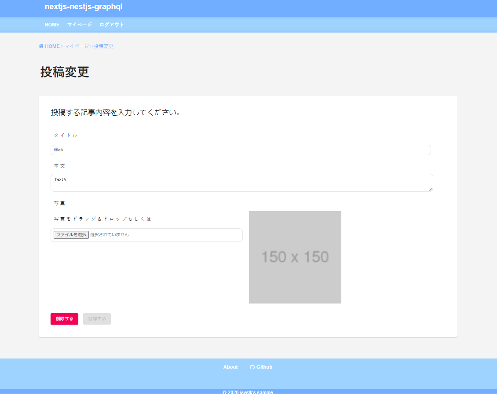
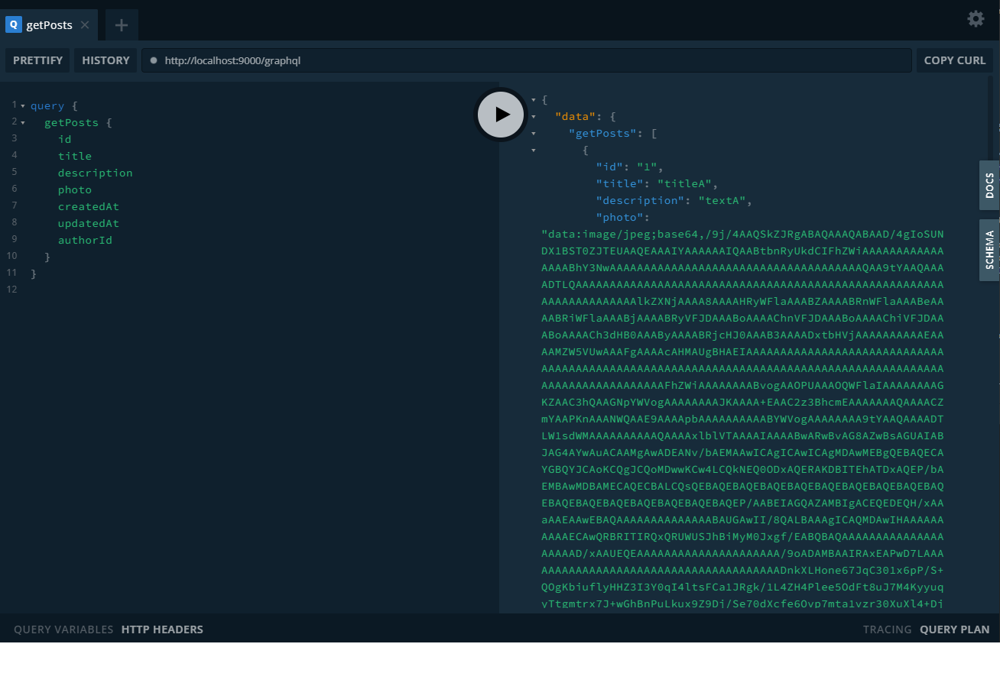
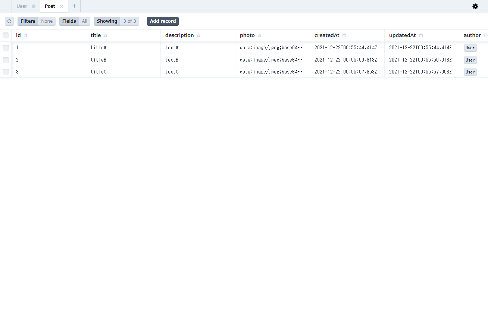

🌙 nextjs-nestjs-graphql
====

[](https://circleci.com/gh/circleci/circleci-docs)


## 📗 プロジェクトの概要

Next.js（フロントエンド）・Nest.js（サーバーサイド）・GraghQLを利用したサンプルアプリケーションです。


### 利用している技術

- Next.js
- typescript 4
- material-ui
- redux-toolkit
- Apollo Client
- Nest.js
- Prisma
- GraphQL


## 🌐 Demo




- ログイン/ログアウト
- 会員登録
- 投稿一覧
- 投稿詳細
- マイページ（一覧・登録・更新・削除）


## 📦 ディレクトリ構造

```
.
├── docker/
│   ├── mysql/
│   ├── nestjs/
│   │   └── app/ (Nest.js のソースコード)
│   │       ├── prisma/
│   │       ├── src/
│   │       └── test/
│   └── docker-compose.yml
└── frontend/
    ├── src/ (Next.js のソースコード)
    │   ├── @types/
    │   ├── auth/
    │   ├── common/
    │   ├── components/
    │   ├── pages/
    │   ├── store/
    │   ├── styles/
    │   └── utilities/
    └── test/
```

## 💬 使い方

### データベースの準備
```
# 下準備
$ ./dc.sh init

# Dockerを起動する
$ ./dc.sh start

# データベースとPHPが立ち上がるまで少し待ちます。(初回は5分程度)

# MySQLにログインしてみる
$ ./dc.sh mysql login

# Dockerを停止する場合
$ ./dc.sh stop
```

### バックエンドの準備
```
$ cd backend
$ cp .env.example .env
$ yarn
$ npx prisma generate
$ npx prisma migrate dev --name post
$ yarn start
```

#### GraghQLの使い方
http://localhost:9000/graphql


```
# 以下のように必要なフィールドのみを指定してデータを取得できます。
-----
query { 
  getPosts {
    id
    title
    description
    photo
    createdAt
    updatedAt
    authorId
  }
}
-----

# Curlで送信する場合は以下のようにJSONにして改行を削除する必要があります。
-----
$ QUERY=$(cat <<EOS
{   "query": "{
     getPosts {
        id
        title
        description
        photo
        createdAt
        updatedAt
        authorId
      }
    }"
}
EOS
) && QUERY=$(echo $QUERY | tr -d '\n')
$ curl -X POST -d "${QUERY}" -H 'Content-Type: application/json' http://localhost:9000/graphql
-----

# データを登録する場合はMutationを利用します。
-----
# ユーザ登録
mutation {
    signup(
      email: "test@test.com"
    	password: "test1234"
      name: "test"
    ) {
    token
  }
}

＃ 投稿
mutation {
  createPost(
    title:"titleA", 
    description:"textA", 
    photo:"data:image/jpeg;base64,/9j/4AAQSkZJRgABAQAAAQABAAD/4gIoSUNDX1BST0ZJTEUAAQEAAAIYAAAAAAIQAABtbnRyUkdCIFhZWiAAAAAAAAAAAAAAAABhY3NwAAAAAAAAAAAAAAAAAAAAAAAAAAAAAAAAAAAAAQAA9tYAAQAAAADTLQAAAAAAAAAAAAAAAAAAAAAAAAAAAAAAAAAAAAAAAAAAAAAAAAAAAAAAAAAAAAAAAAAAAAlkZXNjAAAA8AAAAHRyWFlaAAABZAAAABRnWFlaAAABeAAAABRiWFlaAAABjAAAABRyVFJDAAABoAAAAChnVFJDAAABoAAAAChiVFJDAAABoAAAACh3dHB0AAAByAAAABRjcHJ0AAAB3AAAADxtbHVjAAAAAAAAAAEAAAAMZW5VUwAAAFgAAAAcAHMAUgBHAEIAAAAAAAAAAAAAAAAAAAAAAAAAAAAAAAAAAAAAAAAAAAAAAAAAAAAAAAAAAAAAAAAAAAAAAAAAAAAAAAAAAAAAAAAAAAAAAAAAAAAAAAAAAFhZWiAAAAAAAABvogAAOPUAAAOQWFlaIAAAAAAAAGKZAAC3hQAAGNpYWVogAAAAAAAAJKAAAA+EAAC2z3BhcmEAAAAAAAQAAAACZmYAAPKnAAANWQAAE9AAAApbAAAAAAAAAABYWVogAAAAAAAA9tYAAQAAAADTLW1sdWMAAAAAAAAAAQAAAAxlblVTAAAAIAAAABwARwBvAG8AZwBsAGUAIABJAG4AYwAuACAAMgAwADEANv/bAEMAAwICAgICAwICAgMDAwMEBgQEBAQECAYGBQYJCAoKCQgJCQoMDwwKCw4LCQkNEQ0ODxAQERAKDBITEhATDxAQEP/bAEMBAwMDBAMECAQECBALCQsQEBAQEBAQEBAQEBAQEBAQEBAQEBAQEBAQEBAQEBAQEBAQEBAQEBAQEBAQEBAQEBAQEP/AABEIAGQAZAMBIgACEQEDEQH/xAAaAAEAAwEBAQAAAAAAAAAAAAAABAUGAwII/8QALBAAAgICAQMDAwIHAAAAAAAAAAECAwQRBRITIRQxQRUWUSJhBiMyM0Jxgf/EABQBAQAAAAAAAAAAAAAAAAAAAAD/xAAUEQEAAAAAAAAAAAAAAAAAAAAA/9oADAMBAAIRAxEAPwD7LAAAAAAAAAAAAAAAAAAAAAAAAAAAAAAAAAAAAAADnkXLHone67JqC301x6pP/S+QOgKbiuflyHHZ3I3Y0qI4ltsFCa1JRgk/1L4ZH4Plee5OdFt8uJ7M4KyyuqyTtgmtrx7J+wGhBnPuLkux9Z9Dj/Se70dXcfe6Ovp7mta1vzr30XuXl4+DjTy8qbhVWtzkouWl+dLyB2BHjyGHPLWFXcpXOpXdMU2uhvSe/Zb+PPkj83y30fAsy1iX5Eoxk1GqDkk0t7k/hfuBYApOQ5vKxuDw8+iuj1GY6IRVjarUp6b386S2eauY5LF43K5Pk3x99VUV2lhTlLrnvXS2/wAtpf8AQL0FPh8ny1XIU4HNYmNW8uE5Uzom5JSituEtr3097X4ZcAAAAAAGe4ui6PH83CzBlc7M3JcaZNw7sWl4T/D/ACQqacHKy+LXB8Ldg349ynfKWNKpV1KL6oSk0urfheNmuAGO/n/bv2l6HJ9Xv0u+zLt9vr/udeunXT5997NRyWRDFwbrp488hKDXajHqdjfhR1+5JAGb/hTCyuHuv43Ox33boxvhdFNx6dJdrqe/6PZefK8lvzUJ2cPnQri5SljWJJLbb6X4JoAz2TXTHgOLWfw086qqNLtrUW5Vahrq6P8ALT8NfuVt/Hyz3yORwfHWUYroqca5UulX312KacYtL4Wt6+TZgCgjlfWuZ467GxcmFWErbbZ3Uyr1KUOhQXUlt/qbevHgvwAAAAAAAAAAAAAAAAAAAAAAAAAAAAAAAAAAAAAAAAAAAAAAAAAAAAAAAAAAAA//2Q=="
    authorId: 1
  ) {
    id
  }
}
-----
```

#### Prisma Studio を起動する
```
$ cd backend
$ npx prisma studio
```


### フロントエンド用
```
$ cd frontend
$ cp .env.example .env
$ yarn
$ yarn dev
```
http://localhost:3000

## 🎨 参考

| プロジェクト| 概要|
| :---------------------------------------| :-------------------------------|
| [TypeScript + Prisma + NestJSでGraphQLサーバを作ってみる](https://zenn.dev/rince/articles/50a66241d04f0b)| TypeScript + Prisma + NestJSでGraphQLサーバを作ってみる |


## 🎫 Licence

[MIT](https://github.com/isystk/nextjs-nestjs-graphql/blob/master/LICENSE)

## 👀 Author

[isystk](https://github.com/isystk)

