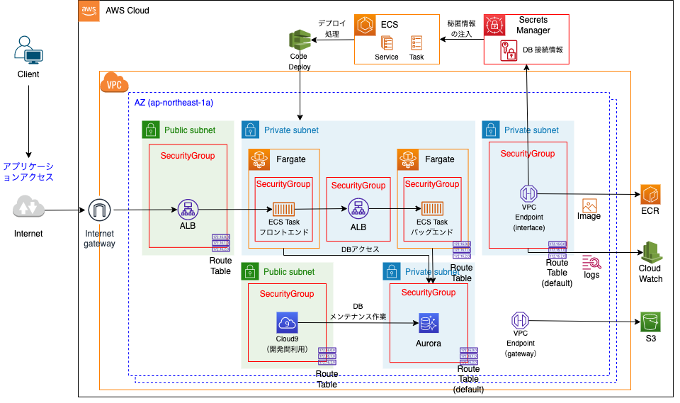

## ネットワーク構成


## 見積もり
https://calculator.aws/#/estimate?id=554054049fbca3545079c3a1213b3beea21d54d4

## VPCネットワークを構築する
CloudFormation → スタック → スタックの作成
- Igress(ALB)用のパブリックサブネット
- フロントアプリ、内部ALBやバックエンドアプリ用のプライベートサブネット
- データベース用のプライベートサブネット
- 管理サーバーやBastion等の運用管理用パブリックサブネット
```text
テンプレートの準備：テンプレートの準備完了
テンプレートの指定：テンプレートファイルのアップロード
ファイル選択：cloudformations/network.cf.yml
スタックの名前： isystk-base
上記以外はデフォルトのまま
```

## アプリケーション用の環境を構築する
CloudFormation → スタック → スタックの作成
- フロントエンド用のECS Cluster
- フロントエンド用のALBやターゲットグループ
- フロントエンド用のCloudWatchロググループ
```text
テンプレートの準備：テンプレートの準備完了
テンプレートの指定：テンプレートファイルのアップロード
ファイル選択：cloudformations/frontend.cf.yml
スタック名： isystk-nextjs-nestjs-graphql-stack
ALBSecurityGroupId：「igress」と名前のつくもの
ALBSubnetId1：「igress-1a」
ALBSubnetId2：「igress-1c」
BackendHost：「https://nextjs-nestjs-graphql.isystk.com」
VpcId：「IsystkVpc」
上記以外はデフォルトのまま
```

## ECSサービスから接続する為のVPCエンドポイントを作成する
VPC → エンドポイント → エンドポイントを作成

-「aws ecr get-login-password」コマンドなどのECR APIの呼び出しに利用されるVPCエンドポイント
```text
名前タグ：isystk-vpce-ecr-api
com.amazonaws.ap-northeast-1.ecr.api
サブネット：「egress」と名前がつくものを選択
セキュリティグループ：「egress」と名前がつくものを選択
```

-「docker image push」コマンドなどのDockerクライアントコマンドの呼び出しに利用されるVPCエンドポイント
```text
名前タグ：isystk-vpce-ecr-dkr
com.amazonaws.ap-northeast-1.ecr.dkr
サブネット：「egress」と名前がつくものを選択
セキュリティグループ：「egress」と名前がつくものを選択
```

- Dockerイメージの取得に利用されるVPCエンドポイント
```text
名前タグ：isystk-vpce-s3
com.amazonaws.ap-northeast-1.s3
Gateway
ルートテーブル：isystk-route-app
```

- Fagateのログの転送経路に利用されるVPCエンドポイント
```text
名前タグ：isystk-vpce-logs
com.amazonaws.ap-northeast-1.logs
サブネット：「egress」と名前がつくものを選択
セキュリティグループ：「egress」と名前がつくものを選択
```

## IAMロールを作成する
```text
CodeDeploy - ECS
ロール名：ecsCodeDeployRole
```

## ECSを作成する

クラスター → isystk-nextjs-nestjs-graphql-cluster → 新しいタスクの実行

```text
起動タイプ：Fargate
オペレーティングシステムファミリー：Linux
タスク定義：isystk-nextjs-nestjs-graphql-def
クラスター：isystk-nextjs-nestjs-graphql-cluster
タスクの数：1
タスクグループ：空のまま
クラスターVPC：isystkVpc
サブネット：「container」と名前のつくものを２つ
セキュリティグループ：「front-container」と名前のつくもの
パブリック IP の自動割り当て：Disabled
```

## 起動したECSタスクのプライベートIPをターゲットグループに紐付ける
EC2 → Target groups → isystk-tg-nextjs-nestjs-graphql → Register targets
```text
Network：isystkVpc
IP address：起動中のECSタスクのプライベートIP
「Include as pending below」を押してPendingに追加
```

ブラウザからフロントエンド用ALBのDNSにアクセスして表示してみる
http://isystk-alb-ingress-nextjs-nestjs-graphql-3550701.ap-northeast-1.elb.amazonaws.com


